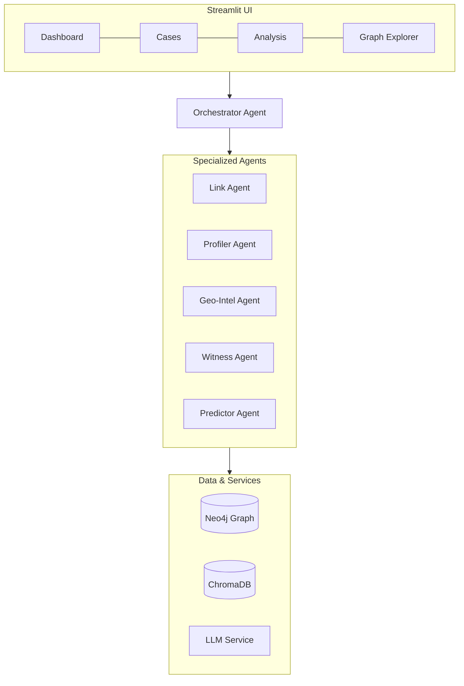

# Cris

# CRIS - Criminal Reasoning Intelligence System

[](https://www.python.org/downloads/)
[](https://opensource.org/licenses/MIT)
[](https://github.com/psf/black)

> A multi-agent AI platform for criminal intelligence, investigation, and predictive analysis.

## Overview

CRIS (Criminal Reasoning Intelligence System) is an open-source platform that helps law enforcement agencies solve crimes faster by:

- **Connecting Evidence**: Building knowledge graphs that reveal hidden relationships between cases, people, and evidence
- **Profiling Suspects**: Generating behavioral profiles based on crime scene analysis and MO patterns
- **Predicting Patterns**: Anticipating criminal behavior through geospatial and temporal analysis
- **Analyzing Statements**: Detecting inconsistencies in witness testimonies

**Core Value Proposition:** Not just process what happened (reactive), but anticipate what could happen (proactive).

## Features

- **Multi-Agent Architecture**: Specialized AI agents for different analysis tasks
- **Knowledge Graph**: Neo4j-powered entity relationships and case connections
- **Semantic Search**: ChromaDB vector store for evidence similarity search
- **Interactive Dashboard**: Streamlit-based UI with graph visualization and maps
- **Extensible**: Plugin system for custom agents and processors
- **Multiple LLM Support**: Works with Gemini, OpenAI, and Anthropic

## Quick Start

### Prerequisites

- Python 3.11+
- Docker (for Neo4j)
- [uv](https://github.com/astral-sh/uv) package manager

### Installation

```bash
# Clone the repository
git clone https://github.com/cris-project/cris.git
cd cris

# Install dependencies
uv sync

# Start Neo4j database
docker-compose up -d

# Copy and configure environment variables
cp .env.example .env
# Edit .env with your API keys (GOOGLE_API_KEY, etc.)

# Initialize the database schema
uv run python -m database.init_schema

# Run the application
uv run streamlit run app.py
```

The application will be available at `http://localhost:8501`

## Architecture



## Agents

| Agent | Purpose |
|-------|---------|
| **Orchestrator** | Coordinates all agents, manages workflow, synthesizes results |
| **Link Agent** | Analyzes knowledge graph to find connections between cases |
| **Profiler Agent** | Generates behavioral profiles for suspects |
| **Geo-Intel Agent** | Analyzes spatial and temporal crime patterns |
| **Witness Agent** | Analyzes statements for inconsistencies |
| **Predictor Agent** | Runs simulations and generates predictions |
| **OSINT Agent** | Digital footprint analysis (mock for MVP) |

## Configuration

CRIS is highly configurable through environment variables. See [`.env.example`](.env.example) for all options.

Key settings:

```bash
# LLM Provider (gemini, openai, anthropic)
LLM_PROVIDER=gemini
GOOGLE_API_KEY=your_key_here

# Neo4j Connection
NEO4J_URI=bolt://localhost:7687
NEO4J_PASSWORD=crispassword

# Feature Flags
ENABLE_PREDICTIONS=true
ENABLE_OSINT=false
```

## Extending CRIS

### Creating Custom Agents

```python
from core.base_agent import BaseAgent
from core.registry import ComponentRegistry

@ComponentRegistry.register_agent("my_agent")
class MyCustomAgent(BaseAgent):
    name = "my_agent"
    description = "My custom analysis agent"
    
    async def process(self, input):
        # Your implementation
        pass
```

See [plugins/README.md](plugins/README.md) for detailed plugin development guide.

## Documentation

Full documentation is available at [https://cris-project.github.io/cris](https://cris-project.github.io/cris)

- [Getting Started](docs/getting-started.md)
- [Architecture](docs/architecture.md)
- [Configuration](docs/configuration.md)
- [Creating Agents](docs/agents/creating-agents.md)
- [Plugin Development](docs/plugins/creating-plugins.md)

## Contributing

We welcome contributions! Please see [CONTRIBUTING.md](CONTRIBUTING.md) for guidelines.

## License

This project is licensed under the MIT License - see the [LICENSE](LICENSE) file for details.

## Disclaimer

CRIS is a tool designed to assist law enforcement professionals. It should be used responsibly and in compliance with all applicable laws and regulations. The predictions and analyses provided are aids to human decision-making, not replacements for professional judgment.

---

**Built with care for justice**
