# CRIS - Criminal Reasoning Intelligence System

[](https://www.python.org/downloads/)
[](https://opensource.org/licenses/MIT)
[](https://deepmind.google/technologies/gemini/)

> Multi-agent AI platform for criminal intelligence powered by **Gemini 3 + ADK + A2A**

**Built for the Google DeepMind Gemini 3 Hackathon** 🚀

## Overview

CRIS helps law enforcement solve crimes faster through AI-powered analysis:

- **🔗 Connect Evidence**: Knowledge graphs reveal hidden relationships
- **🎯 Profile Suspects**: FBI BAU-style behavioral analysis  
- **📊 Predict Patterns**: Geospatial and temporal forecasting
- **👁️ Analyze Statements**: Credibility and deception detection

## Architecture

```mermaid
flowchart TB
    subgraph UI["🖥️ Streamlit UI"]
        User([User Query])
    end
    
    subgraph Orchestration["🧠 Orchestration Layer"]
        Orch[Orchestrator Agent<br/>Gemini 3 + ADK]
    end
    
    subgraph A2A["📡 A2A Protocol"]
        Protocol{A2A<br/>Delegation}
    end
    
    subgraph Agents["🤖 Specialized Agents"]
        Link[Link Agent]
        Profiler[Profiler Agent]
        GeoIntel[Geo-Intel Agent]
        Witness[Witness Agent]
        Predictor[Predictor Agent]
        OSINT[OSINT Agent]
    end
    
    subgraph Data["💾 Data Layer"]
        Neo4j[(Neo4j)]
        Chroma[(ChromaDB)]
    end
    
    User --> Orch
    Orch --> Protocol
    Protocol --> Link & Profiler & GeoIntel & Witness & Predictor & OSINT
    Link & Profiler & GeoIntel & Witness & Predictor & OSINT --> Neo4j & Chroma
```



## Tech Stack

| Component | Technology |
|-----------|------------|
| **AI Engine** | Gemini 3 (`gemini-2.0-flash`) |
| **Agent Framework** | Google ADK |
| **Agent Communication** | A2A Protocol |
| **Knowledge Graph** | Neo4j |
| **Vector Search** | ChromaDB |
| **Frontend** | Streamlit |

## Quick Start

```bash
# Clone and install
git clone https://github.com/cris-project/cris.git
cd cris
uv sync

# Configure
cp .env.example .env
# Add GOOGLE_API_KEY to .env

# Start Neo4j
docker-compose up -d

# Run
uv run streamlit run app.py
```

## Agents

| Agent | Purpose | Key Tools |
|-------|---------|-----------|
| **Orchestrator** | Central coordinator | `delegate_to_agent`, `synthesize_results` |
| **Link Agent** | Graph analysis | `find_similar_cases`, `detect_serial_patterns` |
| **Profiler Agent** | Behavioral profiling | `generate_full_profile`, `assess_risk_level` |
| **Geo-Intel Agent** | Spatial analysis | `generate_hotspot_map`, `predict_next_location` |
| **Witness Agent** | Statement analysis | `analyze_statement`, `detect_inconsistencies` |
| **Predictor Agent** | Forecasting | `predict_next_action`, `model_scenarios` |
| **OSINT Agent** | Digital intelligence | `analyze_digital_footprint`, `assess_online_threat` |

## Documentation

- [Architecture](docs/architecture.md) - Full technical details
- [Getting Started](docs/getting-started.md) - Setup guide
- [Creating Agents](docs/agents/creating-agents.md) - Extend CRIS

## License

MIT License - See [LICENSE](LICENSE)

---

**Built with ❤️ for justice**
