# CRIS Architecture - Gemini 3 + ADK + A2A

> Built for the **Google DeepMind Gemini 3 Hackathon** 🚀

## Overview

CRIS uses Google's latest AI infrastructure:

- **Gemini 3** (`gemini-2.0-flash`): Advanced reasoning model
- **ADK** (Agent Development Kit): Framework for autonomous agents
- **A2A** (Agent-to-Agent Protocol): Inter-agent communication

## Architecture

```mermaid
flowchart TB
    subgraph System["CRIS Multi-Agent System"]
        subgraph Orchestration["Orchestration Layer"]
            Orch[🧠 Orchestrator Agent<br/>CRISOrchestratorAgent<br/>Gemini 3 + ADK]
        end
        
        subgraph A2ALayer["A2A Protocol Layer"]
            A2A{{"📡 A2A Protocol<br/>Task Routing & Communication"}}
        end
        
        subgraph Specialists["Specialized Agents"]
            Link[🔗 Link Agent<br/>Graph Analysis]
            Profiler[🎯 Profiler Agent<br/>Behavioral Analysis]
            GeoIntel[🗺️ Geo-Intel Agent<br/>Spatial Patterns]
            Witness[👁️ Witness Agent<br/>Statement Analysis]
            Predictor[📊 Predictor Agent<br/>Forecasting]
            OSINT[🌐 OSINT Agent<br/>Digital Intel]
        end
    end
    
    User([👤 User]) --> Orch
    Orch <--> A2A
    A2A <--> Link & Profiler & GeoIntel & Witness & Predictor & OSINT
```



## Agent Communication Flow

```mermaid
sequenceDiagram
    participant U as 👤 User
    participant O as 🧠 Orchestrator
    participant A as 📡 A2A Registry
    participant L as 🔗 Link Agent
    participant P as 🎯 Profiler Agent
    participant G as 🗺️ Geo-Intel Agent
    
    U->>O: "Analyze case CASE-2024-001"
    O->>O: Parse Intent
    O->>A: Discover Available Agents
    A-->>O: Agent Cards
    
    par Parallel A2A Delegation
        O->>L: Find similar cases
        O->>P: Generate profile
        O->>G: Analyze locations
    end
    
    L-->>O: Similar cases found
    P-->>O: Behavioral profile
    G-->>O: Hotspot analysis
    
    O->>O: Synthesize Results
    O-->>U: Comprehensive Report
```



## Core Components

### CRISADKAgent (`core/adk_agent.py`)

Base class for all agents:

```python
class CRISADKAgent:
    name: str
    description: str
    model: str = "gemini-2.0-flash"
    
    def get_tools(self) -> List[Callable]
    async def run(self, query: str, ...) -> Dict[str, Any]
    def get_agent_card(self) -> AgentCard
```

### A2A Protocol (`core/a2a_server.py`)

Inter-agent communication:

```python
A2AAgentCard(
    name="profiler_agent",
    description="Behavioral profiling",
    skills=[A2ASkill(id="generate_profile", name="Generate Profile", ...)]
)
```

## Agents & Tools

| Agent | Key Tools |
|-------|-----------|
| **Orchestrator** | `delegate_to_agent`, `synthesize_results`, `analyze_case` |
| **Link Agent** | `find_similar_cases`, `analyze_criminal_network`, `detect_serial_patterns` |
| **Profiler Agent** | `generate_full_profile`, `assess_risk_level`, `analyze_victimology` |
| **Geo-Intel Agent** | `generate_hotspot_map`, `create_geographic_profile`, `predict_next_location` |
| **Witness Agent** | `analyze_statement`, `detect_inconsistencies`, `assess_credibility` |
| **Predictor Agent** | `predict_next_action`, `assess_escalation_risk`, `model_scenarios` |
| **OSINT Agent** | `analyze_digital_footprint`, `assess_online_threat`, `map_online_network` |

## A2A Task Lifecycle


## Configuration

```env
# Required
GOOGLE_API_KEY=your_key_here

# Gemini 3
GEMINI_MODEL=gemini-2.0-flash

# A2A
A2A_ENABLE=true
A2A_ENABLE_STREAMING=true
```

## Running

```bash
uv sync
export GOOGLE_API_KEY=your_key
python main.py test-agents
streamlit run app.py
```

## Hackathon Criteria

| Criteria | Implementation |
|----------|----------------|
| **Technical Execution (40%)** | ADK + A2A + Gemini 3, async parallel execution, 40+ tools |
| **Innovation (30%)** | Multi-agent criminal intelligence, FBI BAU-style profiling |
| **Potential Impact (20%)** | Helps solve crimes faster, connects evidence, predicts behavior |
| **Presentation (10%)** | Streamlit UI with agent visualization, clear docs |

## File Structure


## Dependencies

```toml
"google-adk>=1.0.0"
"google-genai>=1.0.0"
"a2a-sdk>=0.2.0"
```
