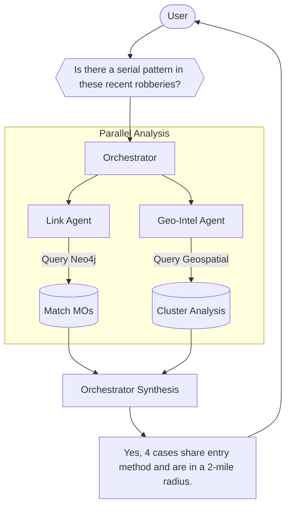

# Intelligence Agents

CRIS uses a "Society of Minds" approach where multiple specialized agents collaborate to analyze a case.

## 🤖 Available Agents

### 1. Orchestrator Agent
The central hub. It parses user questions, selects the right agents to answer, and combines their findings into a report.
- **Location**: `agents/orchestrator.py`
- **Capabilities**: Query routing, result synthesis.

### 2. Link Agent
Analyzes the knowledge graph for non-obvious connections.
- **Location**: `agents/link_agent.py`
- **Capabilities**: Finding similar MOs, identifying common suspects across cases, shortest-path analysis between people.

### 3. Profiler Agent
Performs behavioral and psychological analysis.
- **Location**: `agents/profiler_agent.py`
- **Capabilities**: Suspect profiling, MO analysis, risk assessment.

### 4. Geo-Intel Agent
Analyzes the spatial dimension of crime.
- **Location**: `agents/geo_intel_agent.py`
- **Capabilities**: Hotspot mapping, geographic profiling (anchor point prediction).

### 5. Witness Agent
Specialized in linguistic analysis of statements.
- **Location**: `agents/witness_agent.py`
- **Capabilities**: Inconsistency detection, credibility scoring, deception indicators.

### 6. Predictor Agent
Forecasting and risk simulation.
- **Location**: `agents/predictor_agent.py`
- **Capabilities**: Escalation forecasting, Monte Carlo behavioral simulations.

### 7. OSINT Agent (Experimental)
Integrates digital footprints.
- **Location**: `agents/osint_agent.py`
- **Capabilities**: Social media pattern analysis, public records search.

## 🤝 How Agents Collaboration

When you ask: *"Is there a serial pattern in these recent robberies?"*

1. **Orchestrator** activates **Link Agent** and **Geo-Intel Agent**.
2. **Link Agent** finds cases with matching MOs in Neo4j.
3. **Geo-Intel Agent** identifies if those cases form a spatial cluster.
4. **Orchestrator** combines these findings: *"Yes, there is a strong pattern. 4 cases share the same entry method (Link Agent) and are concentrated within a 2-mile radius of the downtown subway station (Geo-Intel Agent)."*
