# CRIS Agents

CRIS uses specialized AI agents that collaborate via the A2A protocol.

## Agent Architecture

All agents extend `CRISADKAgent` and use Gemini 3 for reasoning:

```python
class CRISADKAgent:
    name: str                    # Unique identifier
    description: str             # What the agent does
    model: str = "gemini-2.0-flash"  # Gemini 3
    
    def get_tools(self) -> List[Callable]:
        """Return agent-specific tools."""
    
    async def run(self, query: str, ...) -> Dict[str, Any]:
        """Execute the agent."""
    
    def get_agent_card(self) -> AgentCard:
        """A2A capability advertisement."""
```

## Available Agents

### Orchestrator (`orchestrator.py`)
Central coordinator that routes queries and synthesizes results.

**Tools:** `delegate_to_agent`, `synthesize_results`, `analyze_case`

### Link Agent (`link_agent.py`)
Graph analysis for case connections and criminal networks.

**Tools:** `find_similar_cases`, `find_common_suspects`, `detect_serial_patterns`, `analyze_criminal_network`

### Profiler Agent (`profiler_agent.py`)
FBI BAU-style behavioral profiling.

**Tools:** `generate_full_profile`, `analyze_crime_scene`, `assess_risk_level`, `analyze_victimology`

### Geo-Intel Agent (`geo_intel_agent.py`)
Spatial pattern analysis and geographic profiling.

**Tools:** `generate_hotspot_map`, `create_geographic_profile`, `predict_next_location`, `detect_temporal_patterns`

### Witness Agent (`witness_agent.py`)
Statement credibility and deception detection.

**Tools:** `analyze_statement`, `assess_credibility`, `detect_inconsistencies`, `cross_reference_statements`

### Predictor Agent (`predictor_agent.py`)
Forecasting and risk simulation.

**Tools:** `predict_next_action`, `assess_escalation_risk`, `model_scenarios`, `forecast_crime_trends`

### OSINT Agent (`osint_agent.py`)
Digital footprint and open-source intelligence.

**Tools:** `analyze_digital_footprint`, `assess_online_threat`, `map_online_network`

## A2A Communication

```mermaid
flowchart TB
    User([👤 User Query]) --> Orch[🧠 Orchestrator<br/>Analyzes Intent]
    
    Orch --> A2A{📡 A2A<br/>Delegation}
    
    A2A --> Link[🔗 Link]
    A2A --> Profiler[🎯 Profiler]
    A2A --> GeoIntel[🗺️ Geo-Intel]
    A2A --> Witness[👁️ Witness]
    A2A --> Predictor[📊 Predictor]
    A2A --> OSINT[🌐 OSINT]
    
    Link & Profiler & GeoIntel & Witness & Predictor & OSINT --> Parallel[⚡ Parallel Processing]
    
    Parallel --> Synthesis[📋 Result Synthesis]
    Synthesis --> Response([📄 Response])
```



Each agent publishes an **Agent Card** for discovery:

```python
A2AAgentCard(
    name="profiler_agent",
    description="Behavioral profiling",
    skills=[
        A2ASkill(id="generate_profile", name="Generate Profile", ...)
    ]
)
```
