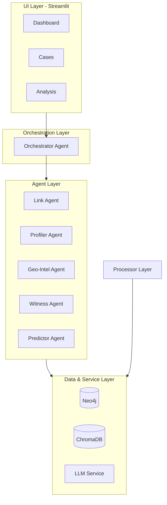
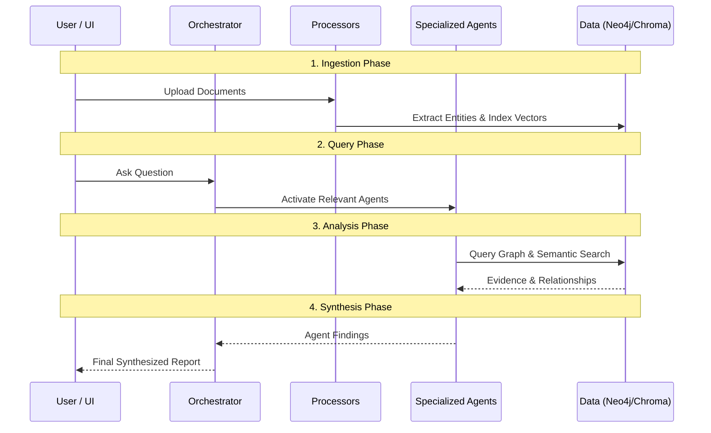

# CRIS Architecture

CRIS follows a modular, extensible architecture designed for scalability and multi-agent collaboration.

## 🏗️ System Overview

The system is composed of several layers, each with a specific responsibility:

### 1. UI Layer (Streamlit)
The frontend provides interactive dashboards, maps, and a chat interface. It communicates with the Orchestrator to trigger investigative tasks.

### 2. Orchestration Layer
The **Orchestrator Agent** is the central brain. It parses user intent and decides which specialized agents to activate. It handles the parallel execution of sub-agents and synthesizes their disparate findings into a cohesive report.

### 3. Agent Layer (Specialized Intelligence)
Individual agents focus on specific investigative domains:
- **Link Agent**: Graph traversals to find connections.
- **Profiler Agent**: Behavioral and psychological analysis.
- **Geo-Intel Agent**: Spatial patterns and hotspots.
- **Witness Agent**: Statement credibility and linguistic analysis.
- **Predictor Agent**: Simulations and forecasting.

### 4. Processor Layer
Handles raw data ingestion. Includes OCR for images/scanned PDFs, Entity Extraction (NER) using LLMs, and Timeline construction.

### 5. Data & Service Layer
- **Neo4j**: Stores the knowledge graph (Entities and Relationships).
- **ChromaDB**: Stores embeddings for semantic search across all case documentation.
- **LLM Service**: Provides a unified interface for different LLM providers (Gemini, OpenAI, Anthropic).

## 🔄 Data Flow

1. **Ingestion**: Documents are uploaded $\rightarrow$ Processors extract text $\rightarrow$ LLM identifies entities $\rightarrow$ Data is stored in Neo4j and indexed in ChromaDB.
2. **Query**: User asks a question $\rightarrow$ Orchestrator parses intent $\rightarrow$ Relevant agents are called.
3. **Analysis**: Link Agent queries Neo4j $\rightarrow$ Witness Agent queries ChromaDB $\rightarrow$ Profiler analyzes findings.
4. **Synthesis**: Orchestrator combines all agent outputs $\rightarrow$ Final report is presented to the investigator.

## 🧩 Extensibility

CRIS is built on **Base Classes** and a **Component Registry**. This allows developers to:
- Add new **Agents** by inheriting from `BaseAgent`.
- Support new **LLM Providers** by inheriting from `BaseLLMProvider`.
- Add new **Processors** for custom file formats.

Plugins are loaded dynamically from the `plugins/` directory at startup.
