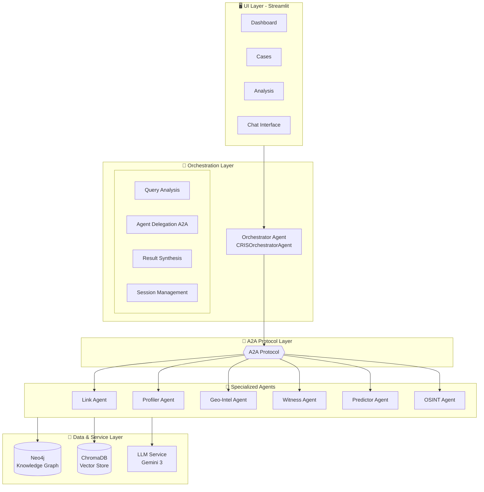
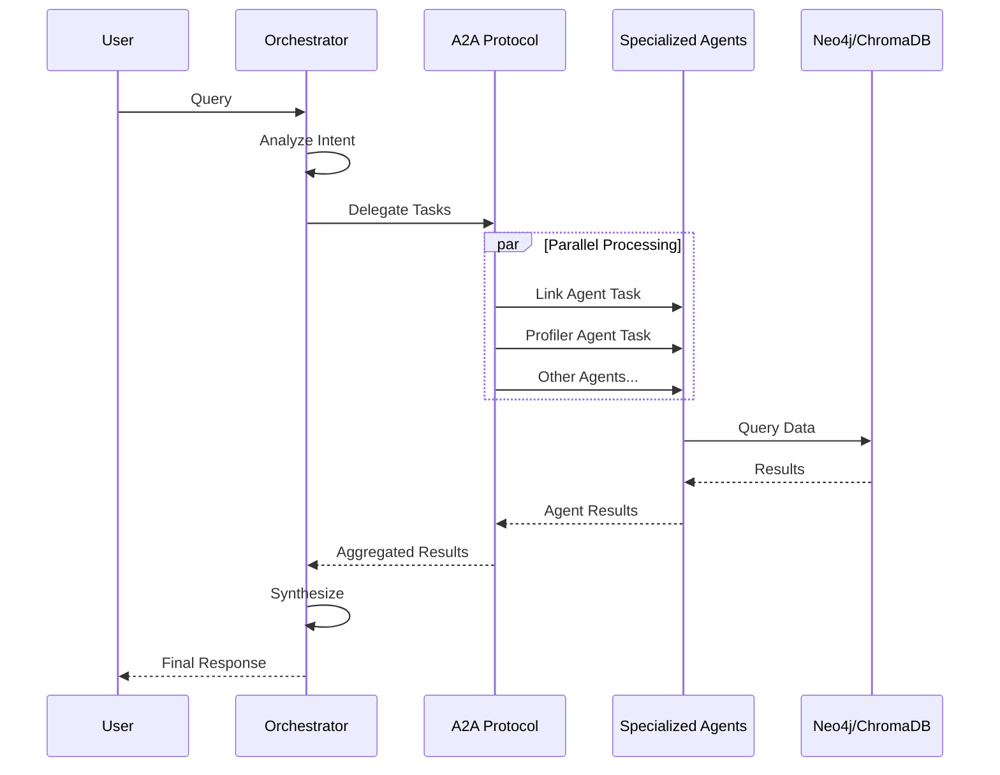

# CRIS Architecture

> For complete technical details, see [GEMINI3_ADK_A2A_ARCHITECTURE.md](GEMINI3_ADK_A2A_ARCHITECTURE.md)

## System Overview



## Core Components

### 1. ADK Agent Base (`core/adk_agent.py`)
- `CRISADKAgent`: Base class for all agents
- `CRISOrchestratorAgent`: Orchestrator with delegation
- `AgentCard`: A2A capability advertisement

### 2. A2A Protocol (`core/a2a_server.py`)
- `A2AHandler`: Process incoming tasks
- `A2AClient`: Communicate with remote agents
- `A2ARegistry`: Local agent discovery

### 3. Data Layer
- **Neo4j**: Knowledge graph (entities, relationships)
- **ChromaDB**: Vector embeddings for semantic search

## Data Flow



## Extensibility

Create custom agents by extending `CRISADKAgent`:

```python
from core.adk_agent import CRISADKAgent, CRISToolResult

class MyAgent(CRISADKAgent):
    name = "my_agent"
    description = "Custom analysis agent"
    
    def get_tools(self):
        return [self.my_tool]
    
    async def my_tool(self, query: str) -> CRISToolResult:
        # Implementation
        return CRISToolResult(success=True, data={...})
```
